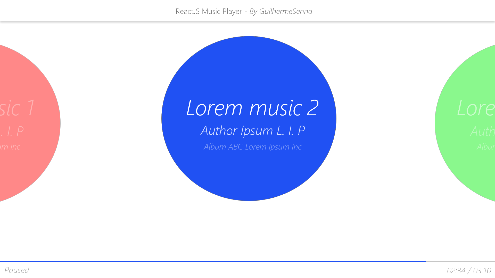
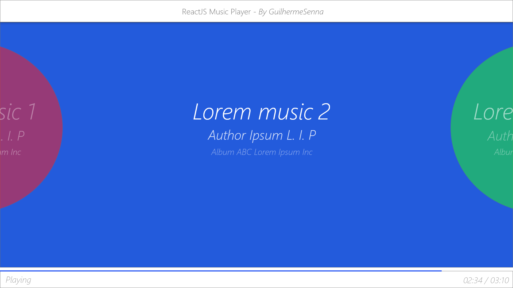
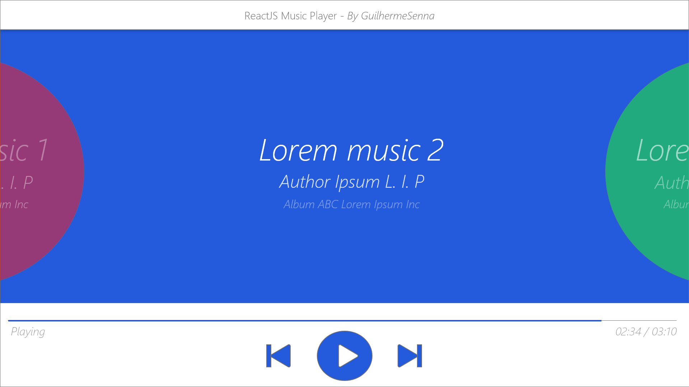

# React-Music-Player

#### Summary:

The purpose of the application is to train with the ReactJS framework and its hooks. In addition, a dynamic CSS will be implemented with several effects that will be described below.

#### Prototype:

The prototyping tool used was Adobe XD, it was a tool presented during the computer science course and already used in previous projects by me and my colleagues.

##### Some screens thought:

**Home screen, paused music and lowered information bar:** 

**Music playing and lowered information bar:**

**Music playing and information bar showing:**

#### Planned effects:

- The paused music remains in a circle, after playing it expands and turns into a rectangle occupying the screen. :construction:
- While the music is paused, the circle remains with a floating effect. :construction:
- When moving to the next or previous song, a side slide effect is made, changing the circles and general colors. :construction:
- When hovering in the status bar it expands smoothly, showing information regarding the song. :construction:
